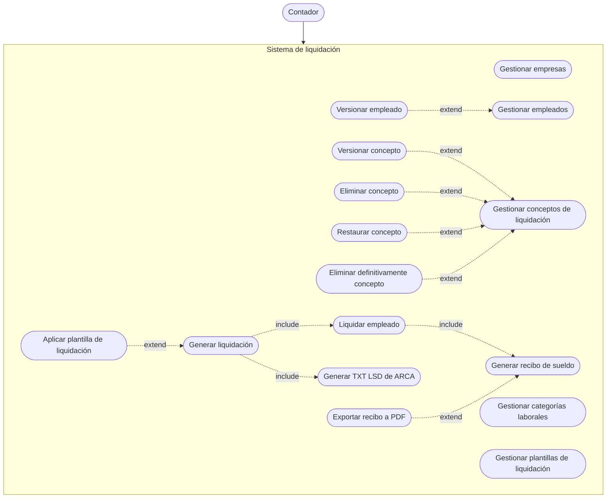

# Casos de Uso

```mermaid
flowchart TB
    Actor([Contador])

    subgraph Sistema["Sistema de liquidación"]

        Gestionar_Empresa([Gestionar empresas])
        Gestionar_Categoria_Laboral([Gestionar categorías laborales])

        Gestionar_Empleado([Gestionar empleados])
        Versionar_Empleado([Versionar empleado])

        Gestionar_Concepto([Gestionar conceptos de liquidación])
        Versionar_Concepto([Versionar concepto])
        Eliminar_Concepto([Eliminar concepto])
        Restaurar_Concepto([Restaurar concepto])
        Eliminar_Definitivamente([Eliminar definitivamente concepto])

        Gestionar_Plantilla([Gestionar plantillas de liquidación])
        Aplicar_Plantilla([Aplicar plantilla de liquidación])

        Generar_Liquidacion([Generar liquidación])
        Liquidar_Empleado([Liquidar empleado])

        Generar_Recibo([Generar recibo de sueldo])
        Exportar_PDF([Exportar recibo a PDF])
        Generar_TXT([Generar TXT LSD de ARCA])

        Versionar_Empleado -.->|extend| Gestionar_Empleado

        Versionar_Concepto -.->|extend| Gestionar_Concepto
        Eliminar_Concepto -.->|extend| Gestionar_Concepto
        Restaurar_Concepto -.->|extend| Gestionar_Concepto
        Eliminar_Definitivamente -.->|extend| Gestionar_Concepto

        Aplicar_Plantilla -.->|extend| Generar_Liquidacion

        Generar_Liquidacion -.->|include| Liquidar_Empleado
        Liquidar_Empleado -.->|include| Generar_Recibo

        Generar_Liquidacion -.->|include| Generar_TXT
        Exportar_PDF -.->|extend| Generar_Recibo
    end

    Actor --> Sistema
```
