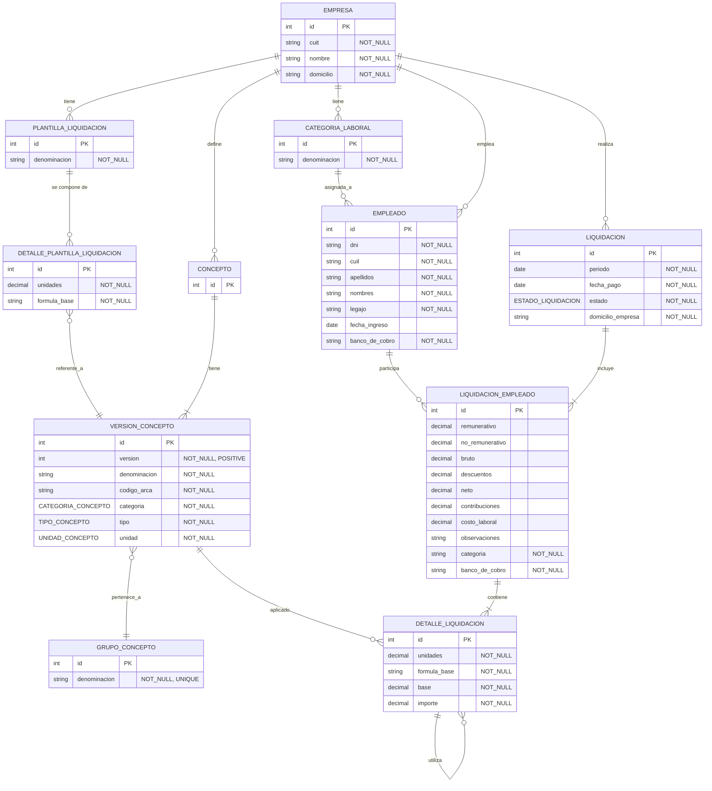

# DER - Diagrama Entidad-Relación

```mermaid
erDiagram
    CONCEPTO ||--|{ VERSION_CONCEPTO : tiene
    VERSION_CONCEPTO }o--|| GRUPO_CONCEPTO : pertenece_a

    EMPRESA ||--o{ PLANTILLA_LIQUIDACION : tiene
    PLANTILLA_LIQUIDACION || --o{ DETALLE_PLANTILLA_LIQUIDACION : "se compone de"
    DETALLE_PLANTILLA_LIQUIDACION }o -- || VERSION_CONCEPTO : referente_a

    EMPRESA ||--o{ CONCEPTO : define
    EMPRESA ||--o{ CATEGORIA_LABORAL : tiene
    EMPRESA ||--o{ EMPLEADO : emplea

    CATEGORIA_LABORAL ||--o{ EMPLEADO : asignada_a

    EMPRESA ||--o{ LIQUIDACION : realiza
    LIQUIDACION ||--|{ LIQUIDACION_EMPLEADO : incluye
    EMPLEADO ||--o{ LIQUIDACION_EMPLEADO : participa

    LIQUIDACION_EMPLEADO ||--|{ DETALLE_LIQUIDACION : contiene
    VERSION_CONCEPTO ||--o{ DETALLE_LIQUIDACION : aplicado

    DETALLE_LIQUIDACION ||--o{ DETALLE_LIQUIDACION : utiliza
    
    EMPRESA {
        int id PK
        %% DJANGO BLANK: false 
        %% Reglas de Negocio: immutable 
        string cuit "NOT_NULL"
        %% DJANGO BLANK: false 
        %% Reglas de Negocio: immutable 
        string nombre "NOT_NULL"
        string domicilio "NOT_NULL"
    }

    PLANTILLA_LIQUIDACION {
        int id PK
        %% DJANGO BLANK: false 
        %% DJANGO UniqueConstraint: fields=["empresa", "denominacion"]
        string denominacion "NOT_NULL"
    }

    DETALLE_PLANTILLA_LIQUIDACION {
        int id PK
        decimal unidades "NOT_NULL"
        %% DJANGO BLANK: false
        string formula_base "NOT_NULL"
    }

    CATEGORIA_LABORAL {
        int id PK
        %% DJANGO BLANK: false 
        %% DJANGO UniqueConstraint: fields=["empresa", "denominacion"]
        %% DJANGO HELP_TEXT: Ej: Personal de Obra, Administrativo, etc 
        string denominacion "NOT_NULL"
    }

    CONCEPTO {
        int id PK
    }

    GRUPO_CONCEPTO {
        int id PK
        %% DJANGO BLANK: false
        %% DJANGO HELP_TEXT: Ej: Seguridad Social, INSSJP, Obra Social, etc
        %% Reglas de Negocio: immutable 
        string denominacion "NOT_NULL, UNIQUE"
    }

    VERSION_CONCEPTO {
        int id PK
        %% DJANGO BLANK: false 
        %% DJANGO UniqueConstraint: fields=["concepto", "version"]
        int version "NOT_NULL, POSITIVE"
        %% DJANGO BLANK: false 
        %% DJANGO HELP_TEXT: Ej: Sueldo Basico, Obra Social, etc
        string denominacion "NOT_NULL"
        %% DJANGO BLANK: false 
        %% DJANGO HELP_TEXT: Referencia a un concepto de ARCA 
        string codigo_arca "NOT_NULL"
        %% DJANGO BLANK: false 
        %% DJANGO CHOICES: trabajador, empleador
        CATEGORIA_CONCEPTO categoria "NOT_NULL"
        %% DJANGO BLANK: false 
        %% DJANGO CHOICES: remunerativo, no remunerativo, descuento, redondeo, contribucion
        TIPO_CONCEPTO tipo "NOT_NULL"
        %% DJANGO BLANK: false 
        %% DJANGO CHOICES: cantidad, porcentaje
        UNIDAD_CONCEPTO unidad "NOT_NULL"
    }

    %% Reglas de Negocio: la categoria_laboral tiene que pertenecer a la misma empresa que el empleado 
    EMPLEADO {
        int id PK
        %% DJANGO BLANK: false 
        %% Reglas de Negocio: immutable 
        string dni "NOT_NULL"
        %% DJANGO BLANK: false 
        %% Reglas de Negocio: immutable 
        string cuil "NOT_NULL"
        %% DJANGO BLANK: false 
        %% Reglas de Negocio: immutable 
        string apellidos "NOT_NULL"
        %% DJANGO BLANK: false 
        %% Reglas de Negocio: immutable 
        string nombres "NOT_NULL"
        %% DJANGO UniqueConstraint: fields=["empresa", "legajo"]
        %% Reglas de Negocio: immutable 
        string legajo "NOT_NULL"
        %% Reglas de Negocio: immutable 
        date fecha_ingreso
        %% DJANGO HELP_TEXT: Ej: Nacion, Bco. Pcia. BS AS, Santander, etc 
        string banco_de_cobro "NOT_NULL"
    }

    LIQUIDACION {
        int id PK
        %% DJANGO BLANK: false 
        %% DJANGO UniqueConstraint: fields=["empresa", "periodo"]
        date periodo "NOT_NULL"
        %% DJANGO BLANK: false 
        date fecha_pago "NOT_NULL"
        %% DJANGO BLANK: false 
        %% DJANGO CHOICES: borrador, cerrada
        %% Reglas de Negocio: una vez cerrada no se puede modificar
        ESTADO_LIQUIDACION estado "NOT_NULL"
        %% snapshot de los datos maestros que son necesarios y que podrian cambiar
        string domicilio_empresa "NOT_NULL"
    }

    %% DJANGO UniqueConstraint: fields=["liquidacion", "empleado"]
    LIQUIDACION_EMPLEADO {
        int id PK
        decimal remunerativo
        decimal no_remunerativo
        decimal bruto
        decimal descuentos
        decimal neto
        decimal contribuciones
        decimal costo_laboral
        %% DJANGO BLANK: true
        string observaciones
        %% snapshot de los datos maestros que son necesarios y que podrian cambiar
        %% DJANGO BLANK: false
        string categoria "NOT_NULL"
        string banco_de_cobro "NOT_NULL"
    }

    DETALLE_LIQUIDACION {
        int id PK
        decimal unidades "NOT_NULL"
        %% DJANGO BLANK: false
        string formula_base "NOT_NULL"
        %% puede estar expresado en terminos de otros conceptos
        decimal base "NOT_NULL"
        %% DJANGO HELP_TEXT: unidades * base
        decimal importe "NOT_NULL"
    }
```
