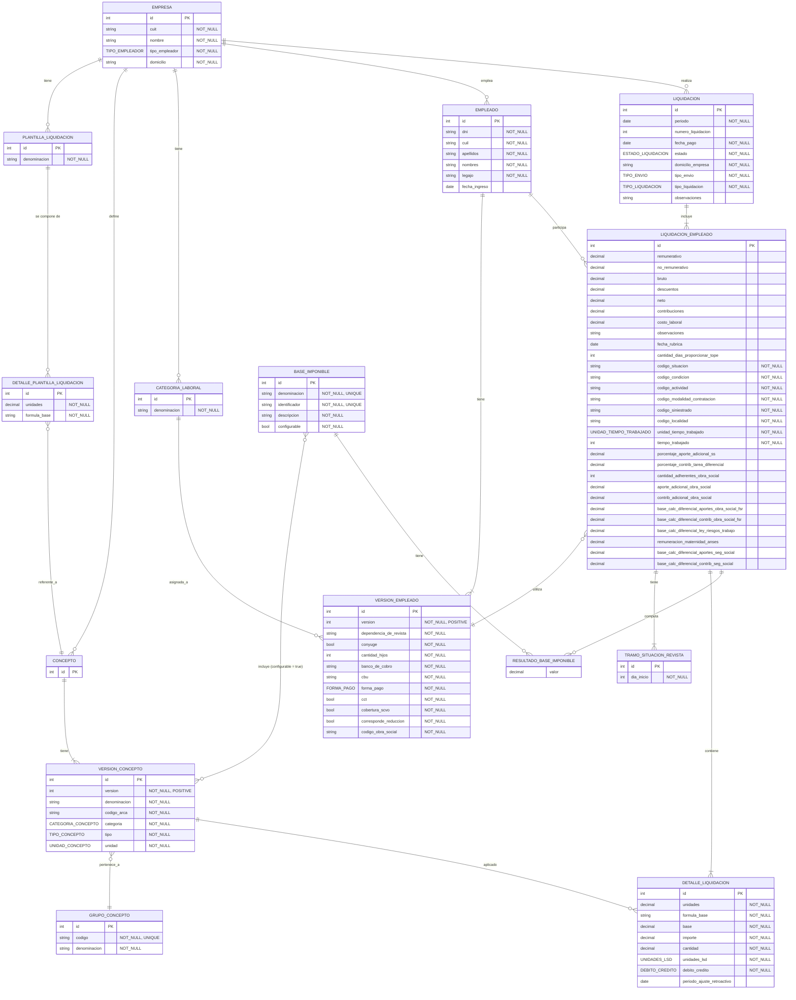

# DER - Diagrama Entidad-Relación

```mermaid
erDiagram
    CONCEPTO ||--|{ VERSION_CONCEPTO : tiene
    VERSION_CONCEPTO }o--|| GRUPO_CONCEPTO : pertenece_a

    EMPRESA ||--o{ PLANTILLA_LIQUIDACION : tiene
    PLANTILLA_LIQUIDACION || --o{ DETALLE_PLANTILLA_LIQUIDACION : "se compone de"
    DETALLE_PLANTILLA_LIQUIDACION }o -- || CONCEPTO : referente_a

    EMPRESA ||--o{ CONCEPTO : define
    EMPRESA ||--o{ CATEGORIA_LABORAL : tiene
    EMPRESA ||--o{ EMPLEADO : emplea
    EMPLEADO ||--|{ VERSION_EMPLEADO : tiene
    %% Reglas de Negocio: la categoria_laboral tiene que pertenecer a la misma empresa que el empleado 
    CATEGORIA_LABORAL ||--o{ VERSION_EMPLEADO : asignada_a

    EMPRESA ||--o{ LIQUIDACION : realiza
    LIQUIDACION ||--|{ LIQUIDACION_EMPLEADO : incluye
    EMPLEADO ||--o{ LIQUIDACION_EMPLEADO : participa
    LIQUIDACION_EMPLEADO }o--|| VERSION_EMPLEADO : utiliza
    LIQUIDACION_EMPLEADO ||--|{ TRAMO_SITUACION_REVISTA : tiene

    LIQUIDACION_EMPLEADO ||--|{ DETALLE_LIQUIDACION : contiene
    VERSION_CONCEPTO ||--o{ DETALLE_LIQUIDACION : aplicado
    
    BASE_IMPONIBLE }o--o{ VERSION_CONCEPTO : "incluye (configurable = true)"
    BASE_IMPONIBLE ||--o{ RESULTADO_BASE_IMPONIBLE : tiene
    LIQUIDACION_EMPLEADO ||--o{ RESULTADO_BASE_IMPONIBLE : computa 

    EMPRESA {
        int id PK
        %% DJANGO BLANK: false 
        %% Reglas de Negocio: immutable 
        string cuit "NOT_NULL"
        %% DJANGO BLANK: false 
        %% Reglas de Negocio: immutable 
        string nombre "NOT_NULL"
        %% DJANGO BLANK: false
        %% Reglas de Negocio: immutable 
        TIPO_EMPLEADOR tipo_empleador "NOT_NULL"
        string domicilio "NOT_NULL"
    }

    PLANTILLA_LIQUIDACION {
        int id PK
        %% DJANGO BLANK: false 
        %% DJANGO UniqueConstraint: fields=["empresa", "denominacion"]
        string denominacion "NOT_NULL"
    }

    DETALLE_PLANTILLA_LIQUIDACION {
        int id PK
        decimal unidades "NOT_NULL"
        %% DJANGO BLANK: false
        string formula_base "NOT_NULL"
    }

    CATEGORIA_LABORAL {
        int id PK
        %% DJANGO BLANK: false 
        %% DJANGO UniqueConstraint: fields=["empresa", "denominacion"]
        %% DJANGO HELP_TEXT: Ej: Personal de Obra, Administrativo, etc 
        string denominacion "NOT_NULL"
    }

    BASE_IMPONIBLE {
        int id PK
        %% DJANGO BLANK: false 
        string denominacion "NOT_NULL, UNIQUE"
        %% DJANGO BLANK: false 
        string identificador "NOT_NULL, UNIQUE"
        %% DJANGO BLANK: true 
        string descripcion "NOT_NULL"
        %% DJANGO BLANK: false 
        %% indica si la composición de la base puede configurarla el usuario asociando conceptos
        bool configurable "NOT_NULL"
    }

    CONCEPTO {
        int id PK
    }

    GRUPO_CONCEPTO {
        int id PK
        %% DJANGO BLANK: false
        %% DJANGO HELP_TEXT: Ej: seguridad_social, inssjp, obra_social, etc
        %% Reglas de Negocio: immutable 
        string codigo "NOT_NULL, UNIQUE"
        %% DJANGO BLANK: false
        %% DJANGO HELP_TEXT: Ej: Seguridad Social, INSSJP, Obra Social, etc
        %% Reglas de Negocio: immutable 
        string denominacion "NOT_NULL"
    }

    VERSION_CONCEPTO {
        int id PK
        %% DJANGO BLANK: false 
        %% DJANGO UniqueConstraint: fields=["concepto", "version"]
        int version "NOT_NULL, POSITIVE"
        %% DJANGO BLANK: false 
        %% DJANGO HELP_TEXT: Ej: Sueldo Basico, Obra Social, etc
        string denominacion "NOT_NULL"
        %% DJANGO BLANK: false 
        %% DJANGO HELP_TEXT: Referencia a un concepto de ARCA 
        string codigo_arca "NOT_NULL"
        %% DJANGO BLANK: false 
        %% DJANGO CHOICES: trabajador, empleador
        CATEGORIA_CONCEPTO categoria "NOT_NULL"
        %% DJANGO BLANK: false 
        %% DJANGO CHOICES: remunerativo, no remunerativo, descuento, contribucion
        TIPO_CONCEPTO tipo "NOT_NULL"
        %% DJANGO BLANK: false 
        %% DJANGO CHOICES: cantidad, porcentaje
        UNIDAD_CONCEPTO unidad "NOT_NULL"
    }

    EMPLEADO {
        int id PK
        %% DJANGO BLANK: false 
        %% Reglas de Negocio: immutable 
        string dni "NOT_NULL"
        %% DJANGO BLANK: false 
        %% Reglas de Negocio: immutable 
        string cuil "NOT_NULL"
        %% DJANGO BLANK: false 
        %% Reglas de Negocio: immutable 
        string apellidos "NOT_NULL"
        %% DJANGO BLANK: false 
        %% Reglas de Negocio: immutable 
        string nombres "NOT_NULL"
        %% DJANGO UniqueConstraint: fields=["empresa", "legajo"]
        %% Reglas de Negocio: immutable 
        string legajo "NOT_NULL"
        %% Reglas de Negocio: immutable 
        date fecha_ingreso
    }
    
    VERSION_EMPLEADO {
        int id PK
        %% DJANGO BLANK: false 
        %% DJANGO UniqueConstraint: fields=["concepto", "version"]
        int version "NOT_NULL, POSITIVE"
        string dependencia_de_revista "NOT_NULL"
        bool conyuge "NOT_NULL"
        int cantidad_hijos "NOT_NULL"
        string banco_de_cobro "NOT_NULL"
        string cbu "NOT_NULL"
        FORMA_PAGO forma_pago "NOT_NULL"
        bool cct "NOT_NULL"
        bool cobertura_scvo "NOT_NULL"
        bool corresponde_reduccion "NOT_NULL"
        string codigo_obra_social "NOT_NULL"
    }

    LIQUIDACION {
        int id PK
        %% DJANGO BLANK: false 
        %% DJANGO UniqueConstraint: fields=["empresa", "periodo"]
        date periodo "NOT_NULL"
        %% Enumera las liquidaciones dentro de un mismo periodo. 
        %% Se computa automaticamente, transparente para el usuario
        int numero_liquidacion
        %% DJANGO BLANK: false 
        date fecha_pago "NOT_NULL"
        %% DJANGO BLANK: false 
        %% DJANGO CHOICES: borrador, en_rectificacion, cerrada
        ESTADO_LIQUIDACION estado "NOT_NULL"
        %% snapshot de los datos maestros que son necesarios y que podrian cambiar
        string domicilio_empresa "NOT_NULL"
        %% DJANGO BLANK: false
        %% default: SJ
        TIPO_ENVIO tipo_envio "NOT_NULL"
        TIPO_LIQUIDACION tipo_liquidacion "NOT_NULL"
        %% DJANGO BLANK: true
        %% Registro 06
        string observaciones
    }

    %% DJANGO UniqueConstraint: fields=["liquidacion", "empleado"]
    LIQUIDACION_EMPLEADO {
        int id PK
        decimal remunerativo
        decimal no_remunerativo
        decimal bruto
        decimal descuentos
        decimal neto
        decimal contribuciones
        decimal costo_laboral
        %% DJANGO BLANK: true
        string observaciones
        date fecha_rubrica
        int cantidad_dias_proporcionar_tope
        string codigo_situacion "NOT_NULL"
        string codigo_condicion "NOT_NULL"
        string codigo_actividad "NOT_NULL"
        string codigo_modalidad_contratacion "NOT_NULL"
        string codigo_siniestrado "NOT_NULL"
        string codigo_localidad "NOT_NULL"
        %% Los dos campos de abajo representan los campos cantidad_dias_trabajados 
        %% y cantidad_horas_trabajadas del registro 04
        %% unidades: horas, dias
        UNIDAD_TIEMPO_TRABAJADO unidad_tiempo_trabajado "NOT_NULL"
        int tiempo_trabajado "NOT_NULL"
        decimal porcentaje_aporte_adicional_ss
        decimal porcentaje_contrib_tarea_diferencial
        int cantidad_adherentes_obra_social
        decimal aporte_adicional_obra_social
        decimal contrib_adicional_obra_social
        decimal base_calc_diferencial_aportes_obra_social_fsr
        decimal base_calc_diferencial_contrib_obra_social_fsr
        decimal base_calc_diferencial_ley_riesgos_trabajo
        decimal remuneracion_maternidad_anses
        decimal base_calc_diferencial_aportes_seg_social
        decimal base_calc_diferencial_contrib_seg_social
    }

    DETALLE_LIQUIDACION {
        int id PK
        %% unidades utilizadas en el cálculo del recibo
        decimal unidades "NOT_NULL"
        %% DJANGO BLANK: false
        string formula_base "NOT_NULL"
        %% puede estar expresado en terminos de otros conceptos
        decimal base "NOT_NULL"
        %% importe calculado a partir de unidades, unidad y base
        decimal importe "NOT_NULL"
        %% cantidad informada en Registro 03 del LSD
        decimal cantidad "NOT_NULL"
        %% DJANGO BLANK: false
        %% unidades informadas en Registro 03 del LSD
        UNIDADES_LSD unidades_lsd "NOT_NULL"
        %% por defecto toma el valor del concepto, se puede cambiar
        DEBITO_CREDITO debito_credito "NOT_NULL"
        date periodo_ajuste_retroactivo
    }

    RESULTADO_BASE_IMPONIBLE {
        decimal valor
    }
    
    TRAMO_SITUACION_REVISTA {
        int id PK
        int dia_inicio "NOT_NULL"
    }
```
