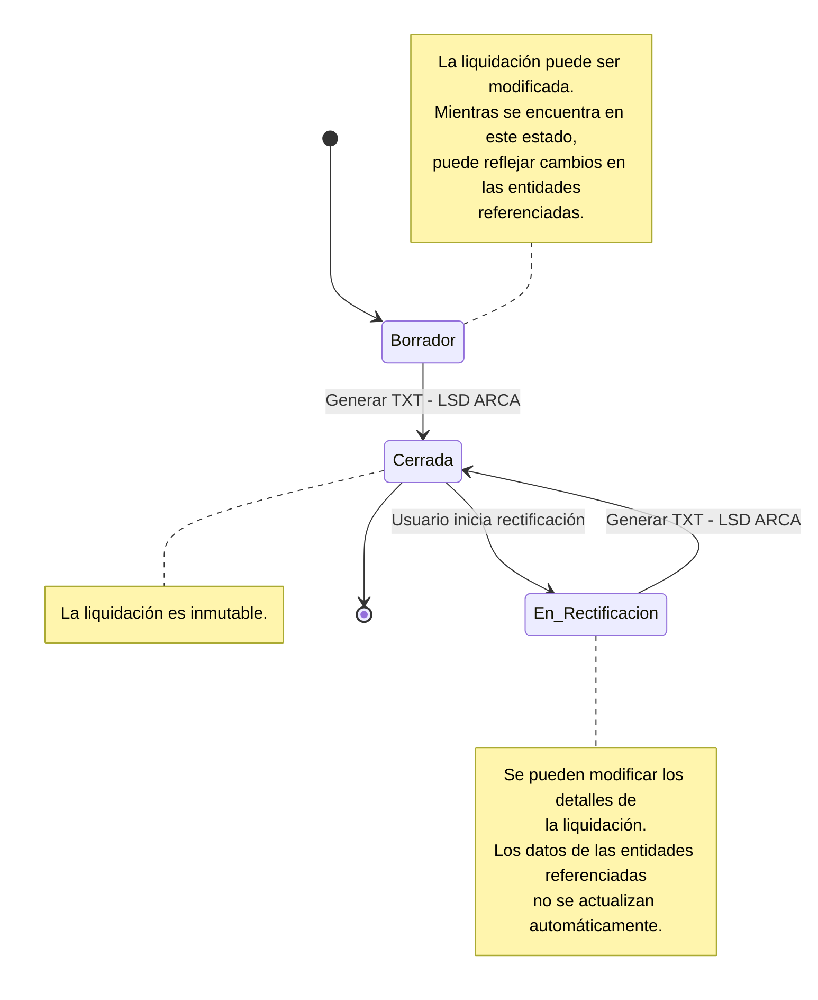

# Estados y ciclo de vida de una liquidación

## Propósito

Este documento describe los estados por los que puede atravesar una liquidación y las operaciones que producen las transiciones entre ellos.

La generación del archivo TXT compatible con el sistema **Libro de Sueldos Digital (LSD) de ARCA** constituye también la operación mediante la cual se valida y cierra la liquidación.

## Estados

Una liquidación puede encontrarse en uno de los siguientes estados:

* **Borrador**: la liquidación se encuentra en proceso de elaboración y puede ser modificada.
* **Cerrada**: la liquidación fue validada mediante la generación del TXT LSD y sus resultados son inmutables.
* **Rectificación**: una liquidación previamente cerrada fue reabierta explícitamente para realizar modificaciones sobre sus detalles.

## Ciclo de vida



## Estado Borrador

Una liquidación se crea inicialmente en estado **Borrador**.

Mientras permanece en este estado:

* Se pueden modificar los datos propios de la liquidación.
* Se pueden incorporar, modificar o eliminar empleados de la liquidación.
* Se pueden modificar los detalles de liquidación de los empleados.
* Se pueden recalcular los importes de los empleados.
* La liquidación puede reflejar cambios en las entidades referenciadas que todavía no hayan sido materializados como información histórica de la liquidación.

El estado Borrador representa, por lo tanto, una liquidación que todavía no constituye una versión histórica definitiva de sus resultados.

### Generación del TXT LSD

En esta primer versión del sistema, la operación **Generar TXT - LSD ARCA** cumple tres funciones:

1. Validar que la liquidación se encuentre en condiciones de ser utilizada para generar el archivo.
2. Generar el archivo TXT compatible con el formato requerido por LSD de ARCA.
3. Cerrar la liquidación.

Si la operación se completa correctamente, la liquidación pasa de **Borrador** a **Cerrada**.

Si la generación del TXT falla por errores de validación o por cualquier otro problema, la liquidación permanece en estado Borrador y puede ser modificada para corregir los errores.

## Estado Cerrada

Una liquidación en estado **Cerrada** representa una versión definitiva de la liquidación realizada.

Mientras se encuentra cerrada:

* La información de la liquidación es inmutable.
* No se pueden modificar sus detalles ni sus resultados.
* Los documentos derivados de la liquidación deben utilizar la información histórica registrada en ella.
* La generación posterior de un recibo de sueldo no modifica la liquidación.
* La generación posterior del TXT tampoco modifica los resultados de la liquidación.

El cierre permite preservar la información utilizada para generar los documentos correspondientes a una liquidación ya realizada.

### Datos históricos

La información necesaria para representar una liquidación cerrada debe encontrarse disponible en la propia liquidación o en las entidades históricas asociadas a ella.

En particular, los datos que hayan sido materializados como parte de la liquidación no deben depender de modificaciones posteriores de los datos maestros.

Esto permite, por ejemplo, regenerar un recibo de sueldo utilizando la información correspondiente al momento en que se realizó la liquidación, aunque posteriormente se modifiquen los datos maestros de la empresa o del empleado.

## Estado En_Rectificacion

Una liquidación cerrada puede pasar a estado **En_Rectificacion** mediante una acción explícita del usuario.

La rectificación permite modificar una liquidación que ya había sido cerrada sin reconstruirla automáticamente a partir del estado actual de las entidades referenciadas.

Mientras se encuentra en este estado:

* Se pueden modificar los detalles de la liquidación.
* Se pueden recalcular los importes afectados.
* Los datos históricos ya registrados en la liquidación se conservan.
* Los cambios posteriores realizados sobre las entidades referenciadas no se incorporan automáticamente a la liquidación.

Una vez finalizadas las modificaciones, la operación **Generar TXT - LSD ARCA** vuelve a validar y generar el archivo correspondiente y la liquidación pasa nuevamente a **Cerrada**.

## Rectificación y datos maestros

La rectificación se diferencia del estado Borrador principalmente por su relación con los datos históricos.

En Borrador, la liquidación todavía se encuentra en proceso de construcción y puede tomar información actualizada de las entidades referenciadas cuando corresponda.

En Rectificación, en cambio, se parte de una liquidación que ya fue cerrada. Por lo tanto, la información histórica que forma parte de ella debe conservarse y no debe ser reemplazada automáticamente por los valores actuales de las entidades maestras.

Si el usuario necesita modificar alguno de esos datos para la rectificación, dicha modificación debe realizarse explícitamente sobre la información correspondiente a la liquidación.

## Inmutabilidad

El estado **Cerrada** constituye el límite de inmutabilidad de una liquidación.

Esto implica que una operación que genere documentos a partir de una liquidación cerrada no debe modificar sus datos.

Por ejemplo:

```text
Liquidación Cerrada
       │
       ├── Generar recibo de sueldo
       │
       └── Generar TXT LSD
```

Estas operaciones generan representaciones de la información de la liquidación, pero no alteran sus resultados.

Para modificar una liquidación cerrada es necesario iniciar explícitamente una **Rectificación**.

## Decisión de diseño de esta primer versión

En esta primer versión se decidió asociar el cierre de la liquidación con la generación del TXT LSD.

Esta decisión simplifica el flujo operativo del sistema, ya que la misma operación que verifica que la liquidación se encuentra en condiciones de ser utilizada para LSD produce también el archivo y establece la versión cerrada de la liquidación.

Esta decisión no implica que conceptualmente la generación del TXT y el cierre sean la misma operación. El cierre representa una decisión sobre el ciclo de vida de la liquidación, mientras que el TXT constituye una representación de sus datos para un sistema externo.

En una versión posterior podrían separarse ambas operaciones si los requisitos funcionales lo justifican.

## Resumen de transiciones

| Estado origen | Operación                            | Estado destino |
| ------------- | ------------------------------------ | -------------- |
| Borrador      | Generar TXT - LSD ARCA correctamente | Cerrada        |
| Cerrada       | Iniciar rectificación                | Rectificación  |
| Rectificación | Generar TXT - LSD ARCA correctamente | Cerrada        |

Una generación del TXT que no pueda completarse correctamente **no produce una transición de estado**.
