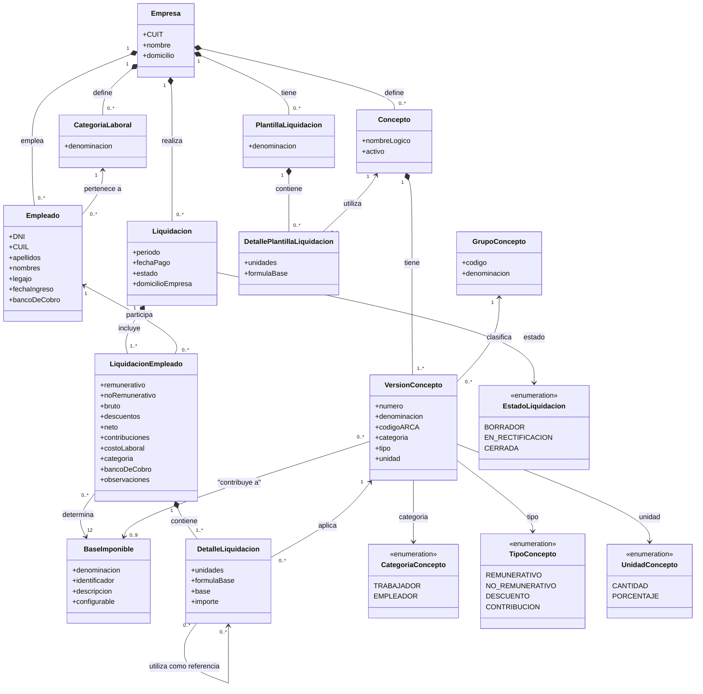

# Modelo de Dominio

```mermaid
classDiagram
    direction TB

    class Empresa {
        +CUIT
        +nombre
        +domicilio
    }

    class Empleado {
        +DNI
        +CUIL
        +apellidos
        +nombres
        +legajo
        +fechaIngreso
        +bancoDeCobro
    }

    class CategoriaLaboral {
        +denominacion
    }

    class BaseImponible {
        +denominacion
        +identificador
        +descripcion
        +configurable
    }

    class Concepto {
        +nombreLogico
        +activo
    }

    class VersionConcepto {
        +numero
        +denominacion
        +codigoARCA
        +categoria
        +tipo
        +unidad
    }

    class GrupoConcepto {
        +codigo
        +denominacion
    }

    class PlantillaLiquidacion {
        +denominacion
    }

    class DetallePlantillaLiquidacion {
        +unidades
        +formulaBase
    }

    class Liquidacion {
        +periodo
        +fechaPago
        +estado
        +domicilioEmpresa
    }

    class LiquidacionEmpleado {
        +remunerativo
        +noRemunerativo
        +bruto
        +descuentos
        +neto
        +contribuciones
        +costoLaboral
        +categoria
        +bancoDeCobro
        +observaciones
    }

    class DetalleLiquidacion {
        +unidades
        +formulaBase
        +base
        +importe
    }

    class CategoriaConcepto {
        <<enumeration>>
        TRABAJADOR
        EMPLEADOR
    }

    class TipoConcepto {
        <<enumeration>>
        REMUNERATIVO
        NO_REMUNERATIVO
        DESCUENTO
        CONTRIBUCION
    }

    class UnidadConcepto {
        <<enumeration>>
        CANTIDAD
        PORCENTAJE
    }

    class EstadoLiquidacion {
        <<enumeration>>
        BORRADOR
        EN_RECTIFICACION
        CERRADA
    }


    Empresa "1" *-- "0..*" Empleado : emplea
    Empresa "1" *-- "0..*" CategoriaLaboral : define
    CategoriaLaboral "1" <-- "0..*" Empleado : pertenece a

    Empresa "1" *-- "0..*" Concepto : define
    Concepto "1" *-- "1..*" VersionConcepto : tiene
    GrupoConcepto "1" <-- "0..*" VersionConcepto : clasifica

    Empresa "1" *-- "0..*" PlantillaLiquidacion : tiene
    PlantillaLiquidacion "1" *-- "0..*" DetallePlantillaLiquidacion : contiene
    Concepto "1" <-- "0..*" DetallePlantillaLiquidacion : utiliza

    Empresa "1" *-- "0..*" Liquidacion : realiza
    Liquidacion "1" *-- "1..*" LiquidacionEmpleado : incluye
    Empleado "1" <-- "0..*" LiquidacionEmpleado : participa

    LiquidacionEmpleado "1" *-- "1..*" DetalleLiquidacion : contiene
    VersionConcepto "1" <-- "0..*" DetalleLiquidacion : aplica

    DetalleLiquidacion "0..*" --> "0..*" DetalleLiquidacion : utiliza como referencia

    LiquidacionEmpleado "0..*" --> "12" BaseImponible : determina
    VersionConcepto "0..*" --> "0..9" BaseImponible : "contribuye a"

    VersionConcepto --> CategoriaConcepto : categoria
    VersionConcepto --> TipoConcepto : tipo
    VersionConcepto --> UnidadConcepto : unidad

    Liquidacion --> EstadoLiquidacion : estado
```
