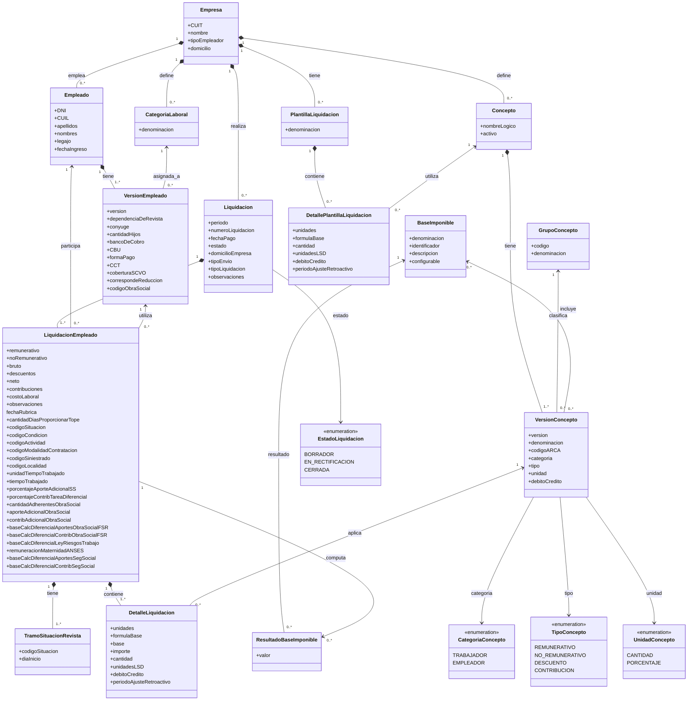

# Modelo de Dominio

```mermaid
classDiagram
    direction TB

    class Empresa {
        +CUIT
        +nombre
        +tipoEmpleador
        +domicilio
    }

    class Empleado {
        +DNI
        +CUIL
        +apellidos
        +nombres
        +legajo
        +fechaIngreso
    }

    class VersionEmpleado {
        +version
        +dependenciaDeRevista
        +conyuge
        +cantidadHijos
        +bancoDeCobro
        +CBU
        +formaPago
        +CCT
        +coberturaSCVO
        +correspondeReduccion
        +codigoObraSocial
    }

    class CategoriaLaboral {
        +denominacion
    }

    class BaseImponible {
        +denominacion
        +identificador
        +descripcion
        +configurable
    }

    class ResultadoBaseImponible {
        +valor
    }

    class Concepto {
        +nombreLogico
        +activo
    }

    class VersionConcepto {
        +version
        +denominacion
        +codigoARCA
        +categoria
        +tipo
        +unidad
        +debitoCredito
    }

    class GrupoConcepto {
        +codigo
        +denominacion
    }

    class PlantillaLiquidacion {
        +denominacion
    }

    class DetallePlantillaLiquidacion {
        +unidades
        +formulaBase
        +cantidad
        +unidadesLSD
        +debitoCredito
        +periodoAjusteRetroactivo
    }

    class Liquidacion {
        +periodo
        +numeroLiquidacion
        +fechaPago
        +estado
        +domicilioEmpresa
        +tipoEnvio
        +tipoLiquidacion
        +observaciones
    }

    class LiquidacionEmpleado {
        +remunerativo
        +noRemunerativo
        +bruto
        +descuentos
        +neto
        +contribuciones
        +costoLaboral
        +observaciones
        fechaRubrica
        +cantidadDiasProporcionarTope
        +codigoSituacion
        +codigoCondicion
        +codigoActividad
        +codigoModalidadContratacion
        +codigoSiniestrado
        +codigoLocalidad
        +unidadTiempoTrabajado
        +tiempoTrabajado
        +porcentajeAporteAdicionalSS
        +porcentajeContribTareaDiferencial
        +cantidadAdherentesObraSocial
        +aporteAdicionalObraSocial
        +contribAdicionalObraSocial
        +baseCalcDiferencialAportesObraSocialFSR
        +baseCalcDiferencialContribObraSocialFSR
        +baseCalcDiferencialLeyRiesgosTrabajo
        +remuneracionMaternidadANSES
        +baseCalcDiferencialAportesSegSocial
        +baseCalcDiferencialContribSegSocial
    }

    class TramoSituacionRevista {
        +codigoSituacion
        +diaInicio
    }

    class DetalleLiquidacion {
        +unidades
        +formulaBase
        +base
        +importe
        +cantidad
        +unidadesLSD
        +debitoCredito
        +periodoAjusteRetroactivo
    }

    class CategoriaConcepto {
        <<enumeration>>
        TRABAJADOR
        EMPLEADOR
    }

    class TipoConcepto {
        <<enumeration>>
        REMUNERATIVO
        NO_REMUNERATIVO
        DESCUENTO
        CONTRIBUCION
    }

    class UnidadConcepto {
        <<enumeration>>
        CANTIDAD
        PORCENTAJE
    }

    class EstadoLiquidacion {
        <<enumeration>>
        BORRADOR
        EN_RECTIFICACION
        CERRADA
    }


    Empresa "1" *-- "0..*" Empleado : emplea
    Empresa "1" *-- "0..*" CategoriaLaboral : define

    Empleado "1" *-- "1..*" VersionEmpleado : tiene
    CategoriaLaboral "1" <-- "0..*" VersionEmpleado : asignada_a

    Empresa "1" *-- "0..*" Concepto : define
    Concepto "1" *-- "1..*" VersionConcepto : tiene
    GrupoConcepto "1" <-- "0..*" VersionConcepto : clasifica

    Empresa "1" *-- "0..*" PlantillaLiquidacion : tiene
    PlantillaLiquidacion "1" *-- "0..*" DetallePlantillaLiquidacion : contiene
    Concepto "1" <-- "0..*" DetallePlantillaLiquidacion : utiliza

    Empresa "1" *-- "0..*" Liquidacion : realiza
    Liquidacion "1" *-- "1..*" LiquidacionEmpleado : incluye

    Empleado "1" <-- "0..*" LiquidacionEmpleado : participa
    VersionEmpleado "1" <-- "0..*" LiquidacionEmpleado : utiliza

    LiquidacionEmpleado "1" *-- "1..*" TramoSituacionRevista : tiene

    LiquidacionEmpleado "1" *-- "1..*" DetalleLiquidacion : contiene
    VersionConcepto "1" <-- "0..*" DetalleLiquidacion : aplica

    BaseImponible "0..*" <-- "0..*" VersionConcepto : incluye
    BaseImponible "1" <-- "0..*" ResultadoBaseImponible : resultado
    LiquidacionEmpleado "1" --> "0..*" ResultadoBaseImponible : computa

    VersionConcepto --> CategoriaConcepto : categoria
    VersionConcepto --> TipoConcepto : tipo
    VersionConcepto --> UnidadConcepto : unidad

    Liquidacion --> EstadoLiquidacion : estado
```
