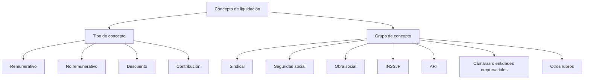

# Lógica de negocio — Tipos de conceptos de liquidación

## 1. Clasificación de los conceptos

Los conceptos que intervienen en una liquidación se clasifican según la forma en que participan económicamente en ella:

| Tipo de concepto    | Quién soporta económicamente | Quién lo ingresa / paga                                               | Efecto en la liquidación                                                                       |
| ------------------- | ---------------------------- | --------------------------------------------------------------------- | ---------------------------------------------------------------------------------------------- |
| **Remunerativo**    | Trabajador                   | Empleador al trabajador                                               | Incrementa la remuneración del trabajador y forma parte de la remuneración bruta               |
| **No remunerativo** | Trabajador                   | Empleador al trabajador                                               | Incrementa lo percibido por el trabajador, pero no forma parte de la remuneración remunerativa |
| **Descuento**       | Trabajador                   | Se retiene al trabajador y se ingresa al destinatario correspondiente | Reduce el importe neto a percibir                                                              |
| **Contribución**    | Empleador                    | Empleador                                                             | Incrementa el costo laboral del empleador, sin reducir el importe neto del trabajador          |

Esta clasificación determina principalmente el efecto del concepto sobre los resultados de la liquidación.

## 2. Aportes y descuentos

Los **aportes personales** no constituyen un tipo de concepto independiente dentro de la liquidación.

Un aporte personal representa una obligación económica a cargo del trabajador cuyo importe es retenido por el empleador. Por este motivo, desde la perspectiva de la liquidación, se clasifica como **descuento**.

Por ejemplo:

| Concepto                                  | Tipo de concepto | Soportado por | Efecto                      |
| ----------------------------------------- | ---------------- | ------------- | --------------------------- |
| Aporte jubilatorio del trabajador         | Descuento        | Trabajador    | Reduce el neto              |
| Aporte de obra social del trabajador      | Descuento        | Trabajador    | Reduce el neto              |
| Aporte INSSJP del trabajador              | Descuento        | Trabajador    | Reduce el neto              |
| Contribución jubilatoria del empleador    | Contribución     | Empleador     | Incrementa el costo laboral |
| Contribución de obra social del empleador | Contribución     | Empleador     | Incrementa el costo laboral |

Por lo tanto, **aporte** no constituye una categoría equivalente a `remunerativo`, `no remunerativo`, `descuento` y `contribución`.

## 3. Diferencia entre tipo de concepto y grupo de concepto

El tipo de concepto y el grupo de concepto representan dimensiones diferentes.

El **tipo de concepto** determina cómo participa económicamente en la liquidación:

* Remunerativo
* No remunerativo
* Descuento
* Contribución

El **grupo de concepto** permite identificar la naturaleza o destino al que pertenece el concepto, independientemente de su efecto económico.

Por ejemplo, pueden existir simultáneamente:

| Concepto                                  | Tipo         | Grupo       |
| ----------------------------------------- | ------------ | ----------- |
| Aporte de obra social del trabajador      | Descuento    | Obra social |
| Contribución de obra social del empleador | Contribución | Obra social |
| Aporte sindical del trabajador            | Descuento    | Sindical    |
| Contribución de ART                       | Contribución | ART         |

De esta manera, un mismo grupo puede contener conceptos de diferentes tipos.

## 4. Efecto sobre los resultados de la liquidación

La clasificación permite determinar los principales resultados de la liquidación.

### Remuneración bruta

La remuneración bruta está compuesta por los conceptos remunerativos y no remunerativos:

```text
Remuneración bruta =
    conceptos remunerativos
    + conceptos no remunerativos
```

### Remuneración neta

La remuneración neta se obtiene a partir de la remuneración bruta, descontando los conceptos que correspondan:

```text
Remuneración neta =
    remuneración bruta
    - descuentos
    + ajustes que correspondan
```

Los aportes personales incluidos en los descuentos reducen, por lo tanto, el importe neto a percibir por el trabajador.

### Costo laboral

El costo laboral incorpora además los conceptos a cargo del empleador:

```text
Costo laboral =
    remuneración bruta
    + contribuciones
```

Las contribuciones patronales no reducen el importe neto del trabajador, sino que representan un costo adicional para el empleador.

## 5. Modelo conceptual

La clasificación puede representarse de manera más simple como dos dimensiones independientes:



El diagrama no representa una jerarquía entre los cuatro tipos. Cada concepto tiene **un tipo** y puede pertenecer además a **un grupo**, siendo ambas clasificaciones independientes.

Por ejemplo:

```text
Concepto: Aporte de obra social
    Tipo:  Descuento
    Grupo: Obra social
```

mientras que:

```text
Concepto: Contribución de obra social
    Tipo:  Contribución
    Grupo: Obra social
```

Esto permite distinguir el efecto económico del concepto de su pertenencia o destino.

## 6. Regla de negocio

**RN-TC-01 — Clasificación de conceptos**

Todo concepto utilizado en una liquidación debe pertenecer a uno de los siguientes tipos:

* Remunerativo
* No remunerativo
* Descuento
* Contribución

Los aportes personales se clasifican como descuentos y las contribuciones patronales se clasifican como contribuciones.

**RN-TC-02 — Independencia de las clasificaciones**

El tipo de concepto y el grupo de concepto representan dimensiones independientes. Un grupo puede contener conceptos de diferentes tipos.

**RN-TC-03 — Efecto económico**

El tipo de concepto determina su participación en los resultados de la liquidación:

* Los conceptos remunerativos y no remunerativos incrementan la remuneración bruta.
* Los descuentos reducen la remuneración neta.
* Las contribuciones incrementan el costo laboral del empleador.

**RN-TC-04 — Correspondencia entre tipo y categoría**

Los conceptos de tipo CONTRIBUCION corresponden a la categoría EMPLEADOR. Los conceptos de cualquier otro tipo corresponden a la categoría TRABAJADOR.
