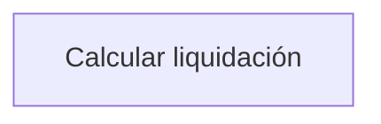
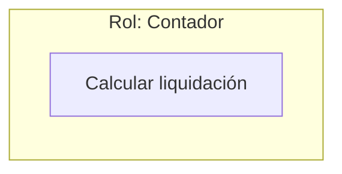
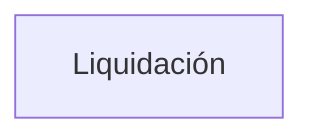
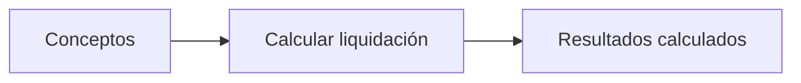
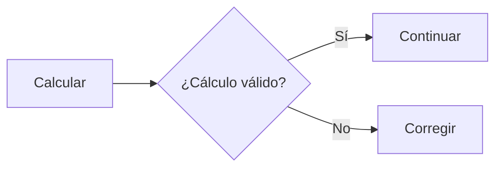
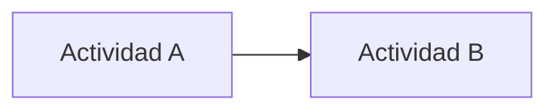
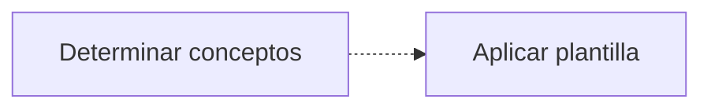
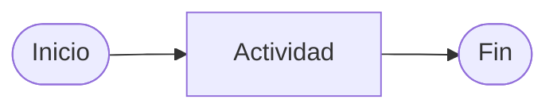

# Especificación y representación de procesos

## 1. Propósito

Los procesos del sistema se documentan mediante modelos inspirados en **SPEM (Software & Systems Process Engineering Metamodel)**.

El objetivo de esta documentación es representar la lógica de negocio asociada a los principales procesos del sistema, haciendo especial énfasis en aquellas reglas, decisiones, dependencias y comportamientos que pueden resultar poco evidentes durante la realización de las actividades.

Para la representación gráfica se utiliza **Mermaid**, debido a su integración con Markdown y GitHub. Por este motivo, los modelos utilizados en el proyecto no siguen estrictamente la nomenclatura ni la notación gráfica oficial de SPEM, sino que constituyen una adaptación simplificada de sus conceptos al lenguaje Mermaid.

La adaptación busca conservar el significado conceptual de SPEM sin introducir una herramienta adicional de modelado que dificulte el mantenimiento y versionado de la documentación.

---

# 2. Vistas utilizadas

Cada proceso se documenta mediante tres vistas complementarias:

1. **Vista funcional y organizacional**
2. **Vista de comportamiento**
3. **Vista de información**

Las vistas representan diferentes aspectos del mismo proceso y deben interpretarse conjuntamente.

## 2.1. Vista funcional y organizacional

Esta vista representa:

* las tareas que componen el proceso;
* las entradas requeridas por cada tarea;
* las salidas o productos generados;
* los roles responsables de realizar las tareas.

La vista funcional responde principalmente:

> **¿Qué actividades se realizan y qué información consumen y producen?**

La dimensión organizacional responde:

> **¿Quién realiza cada actividad?**

En este proyecto existe actualmente un único actor/rol involucrado en los procesos: **Contador**. Por lo tanto, no es necesario introducir una estructura organizacional compleja. La asignación de las tareas al contador se representa directamente en el modelo.

Las actividades triviales de interacción con el sistema, como seleccionar opciones, completar formularios o navegar entre pantallas, no se representan salvo que tengan relevancia para la lógica del proceso.

El foco está puesto en las actividades que representan comportamiento o reglas de negocio.

---

## 2.2. Vista de comportamiento

Esta vista representa la dinámica del proceso y la relación temporal entre sus actividades.

Permite expresar:

* secuencialidad;
* decisiones y condiciones;
* actividades opcionales;
* ciclos y repeticiones;
* caminos alternativos;
* condiciones de finalización;
* dependencias entre actividades;
* paralelismo cuando resulte relevante.

La vista de comportamiento responde principalmente:

> **¿En qué orden se realizan las actividades y bajo qué condiciones se continúa, repite o modifica el flujo?**

Esta vista es especialmente importante para procesos con lógica de negocio compleja.

Por ejemplo, en una liquidación resulta relevante representar que:

* los empleados se procesan individualmente;
* los conceptos de un empleado pueden depender de otros conceptos;
* las referencias entre conceptos deben resolverse antes de completar determinados cálculos;
* una liquidación puede ser modificada mientras permanece abierta;
* la liquidación debe verificarse antes de cerrarse;
* una liquidación cerrada no puede modificarse.

---

## 2.3. Vista de información

La vista de información representa los principales productos de información que intervienen en el proceso y las relaciones entre ellos.

Su objetivo no es reemplazar el modelo de datos ni repetir el DER.

La vista responde principalmente:

> **¿Qué información se utiliza, qué información se produce y cómo se relacionan los documentos o productos de información durante el proceso?**

Por ejemplo, en el proceso de liquidación puede resultar relevante mostrar que:

* una liquidación contiene liquidaciones de empleados;
* una liquidación de empleado contiene detalles de liquidación;
* un detalle utiliza una versión concreta de un concepto;
* un detalle puede referenciar a otro detalle;
* un recibo de sueldo se obtiene a partir de la información de la liquidación del empleado;
* el TXT del Libro de Sueldos Digital se obtiene a partir de la información de la liquidación.

No se incluyen en esta vista atributos, claves, cardinalidades ni detalles de persistencia que ya estén documentados en el DER.

---

# 3. Relación entre la vista de información y el DER

La vista de información y el Ver [Diagrama Entidad-Relación (DER)](./db/der.md). son complementarios y no representan exactamente lo mismo.

La vista de información describe los elementos desde la perspectiva del **proceso**, mientras que el DER describe los elementos desde la perspectiva de la **estructura de datos del sistema**.

Puede establecerse la siguiente correspondencia:

| Vista de información                               | DER                                            |
| -------------------------------------------------- | ---------------------------------------------- |
| Qué información interviene en el proceso           | Cómo se estructura esa información             |
| Qué información consume una actividad              | Qué entidades almacenan esa información        |
| Qué producto de información genera una actividad   | Qué entidades/modelos representan ese producto |
| Relaciones conceptuales relevantes para el proceso | Relaciones persistentes entre entidades        |
| Evolución de la información durante el proceso     | Estructura estática de los datos               |

La lectura conjunta de ambos modelos permite comprender tanto **qué información necesita y produce el proceso** como **cómo dicha información se encuentra estructurada y persistida en el sistema**.

Por ejemplo, la vista de información puede mostrar que una liquidación utiliza una versión concreta de un concepto para generar un detalle de liquidación. El DER permite posteriormente identificar cómo se materializa esa relación mediante las entidades `LIQUIDACION`, `DETALLE_LIQUIDACION` y `VERSION_CONCEPTO`.

De esta manera se evita utilizar el DER para describir aspectos dinámicos del proceso y, a la inversa, se evita utilizar la vista de información para repetir detalles estructurales propios del modelo de datos.

---

# 4. Representación mediante Mermaid

Los diagramas se expresan mediante Mermaid embebido en documentos Markdown.

Mermaid no implementa SPEM de forma nativa. Los elementos gráficos utilizados constituyen una convención definida para este proyecto, inspirada en los conceptos de SPEM.

El objetivo de esta convención es que los diagramas sean:

* legibles;
* simples de mantener;
* versionables junto con el código;
* visualizables directamente desde GitHub;
* suficientemente expresivos para documentar los procesos definidos.

---

# 5. Convenciones gráficas

## 5.1. Actividad o tarea



**Representación:** nodo rectangular.

**Correspondencia conceptual con SPEM:** `Task` / actividad del proceso.

Representa una unidad de trabajo que debe ser realizada como parte del proceso.

Ejemplos:

* Preparar liquidación
* Determinar conceptos
* Calcular liquidación
* Verificar resultados
* Cerrar liquidación

---

## 5.2. Rol



**Representación:** `subgraph` que agrupa las actividades realizadas por un rol.

**Correspondencia conceptual con SPEM:** `Role`.

Permite indicar qué rol participa en la realización de las actividades.

En este proyecto el rol utilizado es:

```text
Contador
```

---

## 5.3. Producto de información



**Representación:** nodo rectangular identificado como producto de información.

**Correspondencia conceptual con SPEM:** `Work Product`.

Representa información utilizada o producida por una actividad.

Ejemplos:

* Liquidación
* Detalle de liquidación
* Recibo de sueldo
* Archivo TXT LSD

Cuando resulte necesario distinguir visualmente productos de información de actividades, se podrá utilizar una forma Mermaid diferente.

---

## 5.4. Entrada o salida de una actividad



Una flecha hacia una actividad representa información utilizada como entrada.

Una flecha desde una actividad representa información producida como salida.

**Correspondencia conceptual con SPEM:** relación entre una actividad y sus `Work Products`.

---

## 5.5. Decisión



**Representación:** nodo con forma de decisión.

**Correspondencia conceptual con SPEM:** condición de flujo dentro de la realización del proceso.

Se utiliza para representar decisiones que modifican el comportamiento del proceso.

---

## 5.6. Flujo de control



**Representación:** flecha continua.

**Correspondencia conceptual con SPEM:** dependencia o flujo de control entre actividades.

Indica que una actividad sucede después de otra dentro del proceso.

---

## 5.7. Flujo opcional



**Representación:** flecha discontinua.

Se utiliza para indicar una relación opcional o de apoyo que no forma parte obligatoria del flujo principal.

No debe interpretarse como una relación UML `include` o `extend` salvo que se indique explícitamente.

---

## 5.8. Inicio y finalización



**Representación:** nodos redondeados.

Se utilizan únicamente en la vista de comportamiento para representar el comienzo y finalización del proceso.

---

# 6. Criterios para la selección del nivel de detalle

Los procesos deben documentarse en un nivel de abstracción orientado a la **lógica de negocio**.

Se incluyen especialmente:

* reglas que condicionan el proceso;
* decisiones que pueden producir resultados diferentes;
* dependencias entre datos;
* cálculos relevantes;
* condiciones de validez;
* estados que modifican el comportamiento;
* información que debe conservarse para garantizar la reproducibilidad;
* relaciones entre documentos o productos de información;
* situaciones que puedan generar ambigüedad durante la implementación.

No se incluyen, salvo que sean relevantes para una regla de negocio:

* navegación por la interfaz;
* botones o controles concretos;
* carga trivial de formularios;
* operaciones CRUD simples;
* detalles de implementación;
* llamadas a métodos o funciones;
* consultas SQL;
* mecanismos internos de Django.

Por ejemplo, no resulta necesario documentar:

> "El contador presiona el botón Guardar."

Sí resulta relevante documentar:

> "Una vez cerrada la liquidación, sus datos no pueden modificarse."

La primera afirmación describe una interacción con la interfaz. La segunda representa una regla de negocio.

# 7. Principio de lectura conjunta

Las tres vistas deben considerarse representaciones complementarias del mismo proceso.

La **vista funcional y organizacional** permite identificar qué se hace y quién lo realiza.

La **vista de comportamiento** permite comprender cuándo y bajo qué condiciones se realizan las actividades.

La **vista de información** permite comprender qué información se utiliza y cómo se transforma o relaciona durante el proceso.

Finalmente, el [DER](./db/der.md) permite profundizar en la estructura persistente de esa información.

Por lo tanto, la documentación puede leerse siguiendo el siguiente recorrido:

```text
Vista funcional y organizacional
              |
              v
      ¿Qué se realiza?
              |
              v
Vista de comportamiento
              |
              v
 ¿Cómo y bajo qué condiciones?
              |
              v
    Vista de información
              |
              v
 ¿Qué información interviene?
              |
              v
             DER
              |
              v
¿Cómo se estructura y persiste?
````

Esta separación permite documentar la lógica del proceso sin convertir los modelos de proceso en una repetición del modelo de datos o de los detalles de implementación.
