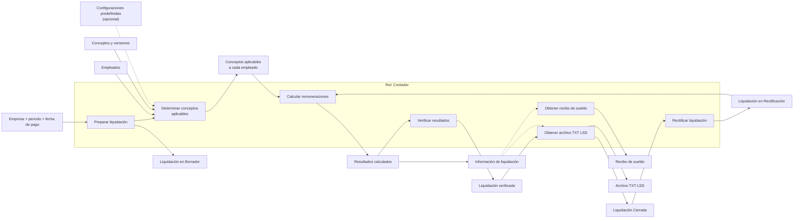
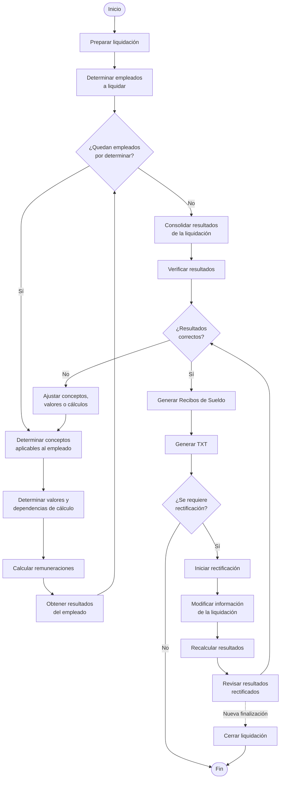
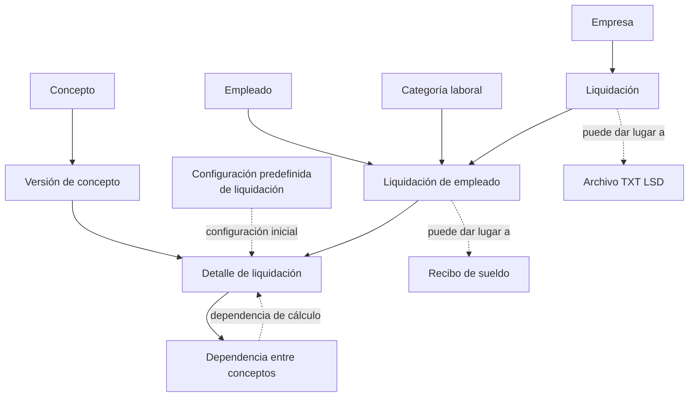

# SPEM-01 — Liquidar sueldos

## Descripción cualitativa

El proceso de liquidar sueldos tiene como objetivo determinar y registrar las remuneraciones correspondientes a los empleados de una empresa para un período determinado.

El proceso es realizado por el **contador** y comprende la preparación de la liquidación, la determinación de los conceptos aplicables a cada empleado, el cálculo de sus importes, la consolidación de los resultados y su verificación.

La liquidación comienza en estado **Borrador**, durante el cual puede ser modificada. Una vez que sus resultados han sido verificados y se consideran definitivos, la liquidación puede pasar al estado **Cerrada**.

Una liquidación cerrada se considera **inmutable**. Si posteriormente fuera necesario modificar sus resultados, puede iniciarse una **Rectificación**. La rectificación parte de la información histórica de la liquidación cerrada y permite modificar sus detalles y recalcular sus resultados. Los datos de las entidades referenciadas no se actualizan automáticamente durante este proceso.

Una liquidación rectificada puede volver a cerrarse una vez finalizada la revisión de sus resultados.

La generación del **recibo de sueldo** y del **archivo TXT compatible con el Libro de Sueldos Digital de ARCA** constituye la obtención de productos derivados de la información de la liquidación. Ambos pueden generarse cuando se dispone de la información necesaria, sin que exista un orden obligatorio entre ellos. Su generación no forma parte necesariamente de la secuencia principal de preparación y cálculo de la liquidación.

El proceso debe conservar la información necesaria para reproducir posteriormente los resultados de la liquidación, independientemente de modificaciones posteriores realizadas sobre los datos maestros utilizados para generarla.

Que una liquidación conserve su información histórica no implica necesariamente que la generación futura de los documentos derivados sea reproducible idénticamente. El sistema conserva los datos históricos, pero el formato y criterio utilizados para generar los recibos/TXT puede cambiar con el tiempo.

---

# Vista funcional y organizacional

Las actividades del proceso se representan junto con los principales productos de información que consumen y generan. Todas las actividades son realizadas por el **contador**.

### Actividades relevantes

#### Preparar liquidación

Establece la empresa, el período y la fecha de pago correspondientes a la liquidación.

La liquidación se inicia en estado **Borrador** y durante esta etapa puede ser modificada.

La información propia de la liquidación que resulte necesaria para reproducir posteriormente sus resultados debe quedar asociada a ella.

#### Determinar conceptos aplicables

Para cada empleado se determina el conjunto de conceptos que corresponde considerar en la liquidación.

Los conceptos pueden determinarse individualmente o a partir de una configuración predefinida.

Los datos del empleado y conceptos utilizados en una liquidación se materializan mediante una **versión concreta de cada entidad**, de manera que las modificaciones posteriores en sus características no alteren los resultados históricos.

#### Calcular remuneraciones

Para cada empleado se determinan los valores necesarios para calcular los conceptos correspondientes.

El cálculo considera las unidades, bases y expresiones asociadas a cada detalle.

Las expresiones pueden establecer dependencias entre conceptos. Cuando un concepto depende del resultado de otro, dicha dependencia debe resolverse antes de realizar el cálculo correspondiente.

A partir de los conceptos calculados se determinan, entre otros, los siguientes resultados:

* remunerativo;
* no remunerativo;
* remuneración bruta;
* descuentos;
* remuneración neta;
* contribuciones;
* costo laboral.

Los valores necesarios para reproducir posteriormente estos resultados forman parte de la información histórica de la liquidación.

#### Verificar resultados

El contador verifica los resultados obtenidos para los empleados incluidos en la liquidación.

La verificación puede llevar a modificar los conceptos, los valores utilizados para el cálculo o las relaciones entre ellos, y a recalcular los resultados.

Mientras la liquidación no haya sido finalizada, este ciclo puede repetirse hasta obtener los resultados considerados correctos.

#### Rectificar liquidación

Una liquidación cerrada puede ser reabierta mediante una **Rectificación** cuando resulte necesario modificar sus resultados.

La rectificación parte de la información histórica conservada en la liquidación.

Durante la rectificación pueden modificarse los detalles de la liquidación y recalcularse sus resultados. Los datos de las entidades referenciadas no se actualizan automáticamente a partir de sus valores actuales.

Una vez finalizada la revisión, la liquidación puede volver a cerrarse.

#### Obtener recibo de sueldo

A partir de la información de la liquidación se obtiene el recibo de sueldo correspondiente a un empleado.

El recibo representa los resultados registrados para el empleado y puede obtenerse cuando se dispone de la información necesaria para construirlo.

La obtención del recibo no modifica los resultados ni el estado de la liquidación.

#### Obtener archivo TXT LSD

A partir de la información de la liquidación se obtiene el archivo compatible con el Libro de Sueldos Digital de ARCA.

El archivo representa información de la liquidación destinada a su utilización con dicho sistema.

Al generar el TXT, la liquidación se considera finalizada y pasa al estado **Cerrada**.

La liquidación cerrada constituye el registro histórico de los resultados correspondientes al período liquidado y se considera inmutable.

La obtención del archivo no constituye conceptualmente una etapa posterior obligatoria a la generación del recibo, ni existe un orden de negocio establecido entre ambos productos.

---

# Vista de comportamiento

La vista de comportamiento representa la **lógica del proceso de negocio**, incluyendo las actividades que se repiten, las decisiones y el ciclo de rectificación.

No se representa en esta vista la interacción con una aplicación ni el mecanismo mediante el cual cada actividad es ejecutada.

### Lógica del proceso

* La liquidación se prepara para una empresa, un período y una fecha de pago determinados.
* Se determina el conjunto de empleados que participan de la liquidación.
* Para cada empleado se determinan los conceptos que corresponden considerar.
* Los conceptos utilizados en la liquidación deben quedar asociados a versiones concretas de dichos conceptos.
* El cálculo de un concepto puede depender del resultado de otros conceptos del mismo empleado.
* Las dependencias entre conceptos deben resolverse antes de obtener los resultados que dependen de ellas.
* Los resultados de cada empleado se consolidan como parte de la liquidación.
* Los resultados pueden ser revisados y, cuando sea necesario, recalculados.
* Mientras la liquidación se encuentre en preparación, el ciclo de determinación, cálculo y revisión puede repetirse.
* Una vez que los resultados se consideran definitivos, cuando el contador genere el TXT la liquidación pasará a estado **Cerrada**.
* Una liquidación cerrada conserva los resultados obtenidos y no debe modificarse.
* Si una liquidación cerrada requiere modificaciones posteriores, se inicia una **Rectificación**.
* La rectificación parte de la información histórica de la liquidación y permite modificar sus detalles y recalcular sus resultados.
* Durante una rectificación no se reemplazan automáticamente los datos históricos de la liquidación por los valores actuales de las entidades que participaron en ella.
* Una rectificación atraviesa nuevamente las etapas de modificación, cálculo y verificación antes de volver a finalizarse.
* La generación del recibo de sueldo y del archivo TXT LSD son obtenciones derivadas de la información de la liquidación.
* Ambos productos pueden obtenerse independientemente cuando exista información suficiente para producirlos.
* No existe una dependencia de negocio entre la generación del recibo y la del archivo TXT LSD.
* La obtención de cualquiera de estos productos no modifica conceptualmente los resultados de la liquidación.

### Ciclo de rectificación

Ver [modelo de estados para las liquidaciones](../dominio/estados_liquidacion.md)

---

# Vista de información

Esta vista representa los principales **productos de información del proceso y sus relaciones conceptuales**, sin reproducir la estructura completa del modelo de datos.

### Productos de información

| Producto                      | Descripción                                                                                                                                                  |
| ----------------------------- | ------------------------------------------------------------------------------------------------------------------------------------------------------------ |
| **Liquidación**               | Representa la liquidación de una empresa para un período y fecha de pago determinados y conserva los resultados correspondientes.                            |
| **Liquidación de empleado**   | Representa la participación de un empleado en una liquidación y conserva los resultados asociados a su remuneración.                                         |
| **Detalle de liquidación**    | Representa la aplicación de una versión de concepto a un empleado y conserva los valores utilizados para su cálculo.                                         |
| **Referencia entre detalles** | Representa una dependencia entre conceptos que intervienen en el cálculo de un empleado. La dependencia se determina a partir de las expresiones de cálculo. |
| **Recibo de sueldo**          | Documento que representa los resultados de la liquidación correspondientes a un empleado.                                                                    |
| **Archivo TXT LSD**           | Archivo que representa la información de la liquidación requerida para su utilización con el Libro de Sueldos Digital de ARCA.                               |

La estructura detallada de estos elementos, sus atributos, claves y cardinalidades se encuentra definida en el **modelo de datos / DER** del sistema y no se replica en esta vista.

---

# Consideraciones sobre los estados y los productos derivados

Los estados de la liquidación representan principalmente su **condición dentro del ciclo de determinación, revisión y modificación de resultados**:

| Estado            | Significado                                                                                |
| ----------------- | ------------------------------------------------------------------------------------------ |
| **Borrador**      | La liquidación se encuentra en preparación y sus resultados todavía pueden modificarse.    |
| **Cerrada**       | Los resultados fueron finalizados y la liquidación se considera inmutable.                 |
| **Rectificación** | Una liquidación previamente cerrada fue reabierta para modificar y revisar sus resultados. |

La generación de documentos constituye una dimensión diferente del proceso.

El recibo de sueldo y el archivo TXT LSD son productos derivados de la información de la liquidación y no representan estados de la misma. Por lo tanto:

* la generación de un recibo no implica un cambio de estado;
* la generación del archivo TXT no constituye conceptualmente una etapa posterior obligatoria a la generación del recibo;
* ambos documentos pueden obtenerse en distintos momentos del ciclo, siempre que exista información suficiente;
* la generación de documentos no modifica por sí misma los resultados históricos de la liquidación.

La forma concreta en que la aplicación vincula determinadas operaciones con las transiciones de estado constituye una **decisión de implementación** y debe documentarse separadamente de la lógica del proceso de negocio.
