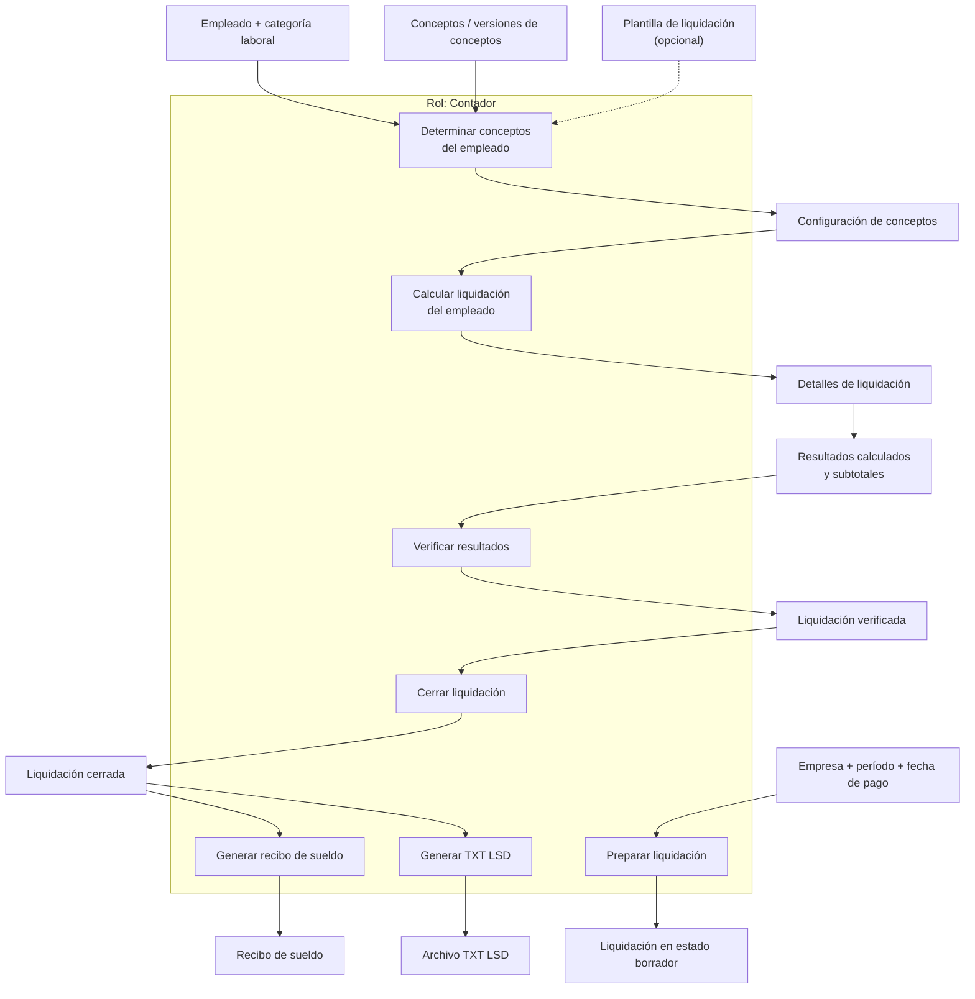
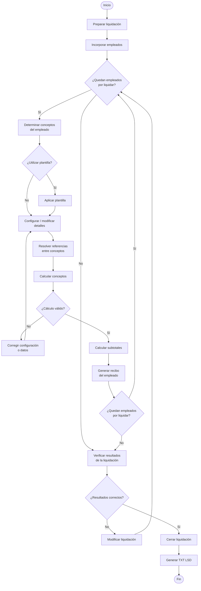
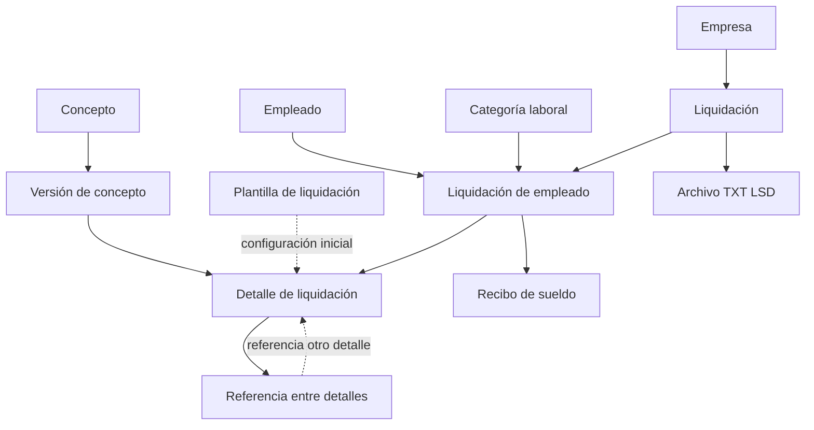

# SPEM-01 — Liquidar sueldos

## Descripción cualitativa

El proceso de liquidar sueldos tiene como objetivo determinar y registrar las remuneraciones correspondientes a los empleados de una empresa para un período determinado.

El proceso es realizado por el **contador** y comprende la preparación de una liquidación, la determinación de los conceptos correspondientes a cada empleado, el cálculo de sus importes y la generación de los resultados necesarios para emitir los recibos de sueldo y el archivo compatible con el Libro de Sueldos Digital de ARCA.

La liquidación se inicia en estado de **borrador**, durante el cual puede ser modificada. Una vez verificados los resultados, el contador puede cerrarla. Una liquidación cerrada es inmutable.

El proceso debe conservar la información necesaria para reproducir posteriormente los resultados de la liquidación, independientemente de modificaciones posteriores realizadas sobre los datos maestros utilizados para generarla.

---

# Vista funcional y organizacional

Las actividades del proceso se representan junto con los productos de información que consumen y generan. Todas las actividades son realizadas por el **contador**.

### Actividades relevantes

#### Preparar liquidación

Crea una liquidación para una empresa y período determinado.

La liquidación comienza en estado **borrador** y debe conservar la fecha de pago correspondiente. Para este proyecto se considera una liquidación mensual, por lo que la fecha de pago debe pertenecer al período liquidado.

La liquidación conserva determinados datos de la empresa que resultan necesarios para reproducir posteriormente la documentación generada.

#### Determinar conceptos del empleado

Para cada empleado se determina el conjunto de conceptos que intervienen en su liquidación.

Los conceptos utilizados corresponden a una **versión concreta de un concepto**, de modo que modificaciones posteriores en la definición del concepto no alteran una liquidación ya realizada.

Los conceptos pueden incorporarse individualmente o mediante una **plantilla de liquidación**.

La plantilla solamente proporciona una configuración inicial. Los detalles incorporados a la liquidación son independientes de la plantilla y pueden ser modificados antes de guardar la liquidación.

#### Calcular liquidación del empleado

Para cada detalle de liquidación se determinan las unidades, la base y el importe correspondientes.

Las expresiones de cálculo pueden utilizar referencias a otros detalles de la misma liquidación mediante sus identificadores.

El cálculo debe respetar las dependencias existentes entre los conceptos referenciados.

A partir de los detalles calculados se determinan, entre otros, los siguientes resultados:

* remunerativo;
* no remunerativo;
* remuneración bruta;
* descuentos;
* remuneración neta;
* contribuciones;
* costo laboral.

La información necesaria para reproducir estos resultados queda asociada a la liquidación.

#### Verificar resultados

El contador verifica los resultados obtenidos para los empleados incluidos en la liquidación.

Mientras la liquidación permanezca abierta, los detalles y resultados pueden ser modificados y recalculados.

#### Cerrar liquidación

Una vez verificados los resultados, el contador cierra la liquidación.

El cierre establece la liquidación como **inmutable**. A partir de ese momento no deben modificarse sus datos ni los resultados de los empleados que la componen.

#### Generar recibo de sueldo

A partir de los datos históricos de la liquidación de cada empleado se genera su recibo de sueldo.

El recibo debe utilizar la información conservada en la liquidación y no depender de los valores actuales de los datos maestros que puedan haber cambiado posteriormente.

#### Generar TXT LSD

A partir de la información registrada en la liquidación cerrada se genera el archivo TXT compatible con el Libro de Sueldos Digital de ARCA.

---

# Vista de comportamiento

La vista de comportamiento representa la secuencia, repetición y condiciones relevantes durante la realización del proceso.

### Reglas de comportamiento relevantes

* Una liquidación se mantiene en estado **borrador** mientras pueda ser modificada.
* El cálculo se realiza individualmente para cada empleado incluido en la liquidación.
* La utilización de una plantilla es opcional.
* Las referencias entre conceptos se resuelven dentro de la liquidación del empleado correspondiente.
* Una referencia a un identificador inexistente impide realizar correctamente el cálculo.
* Los conceptos deben calcularse respetando las dependencias entre ellos.
* Los resultados de un empleado se obtienen antes de continuar con el siguiente.
* La liquidación solamente puede cerrarse una vez que el contador ha verificado sus resultados.
* Una vez cerrada, la liquidación no puede ser modificada.

---

# Vista de información

Esta vista representa los principales **productos de información del proceso y sus relaciones**, sin reproducir la estructura completa del modelo de datos.

### Productos de información

| Producto                      | Descripción                                                                                                                       |
| ----------------------------- | --------------------------------------------------------------------------------------------------------------------------------- |
| **Liquidación**               | Representa la liquidación de una empresa para un período y fecha de pago determinados.                                            |
| **Liquidación de empleado**   | Representa la participación de un empleado en una liquidación y conserva la información necesaria para reproducir sus resultados. |
| **Detalle de liquidación**    | Representa la aplicación de una versión de concepto a un empleado y contiene los valores utilizados para su cálculo.              |
| **Referencia entre detalles** | Permite que el cálculo de un detalle utilice el resultado de otro detalle del mismo empleado.                                     |
| **Recibo de sueldo**          | Documento generado a partir de los resultados registrados para un empleado.                                                       |
| **Archivo TXT LSD**           | Archivo generado a partir de la información de la liquidación para su utilización con el Libro de Sueldos Digital de ARCA.        |

La estructura detallada de estos elementos, sus atributos, claves y cardinalidades se encuentra definida en el **modelo de datos / DER** del sistema y no se replica en esta vista.
