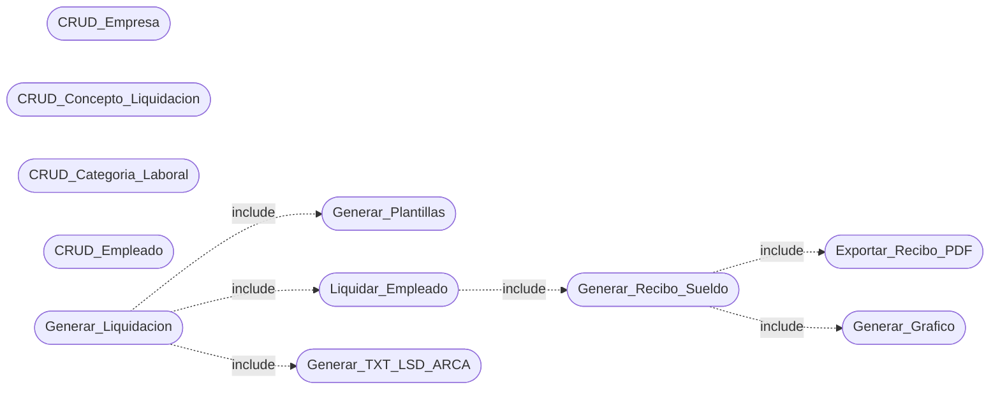
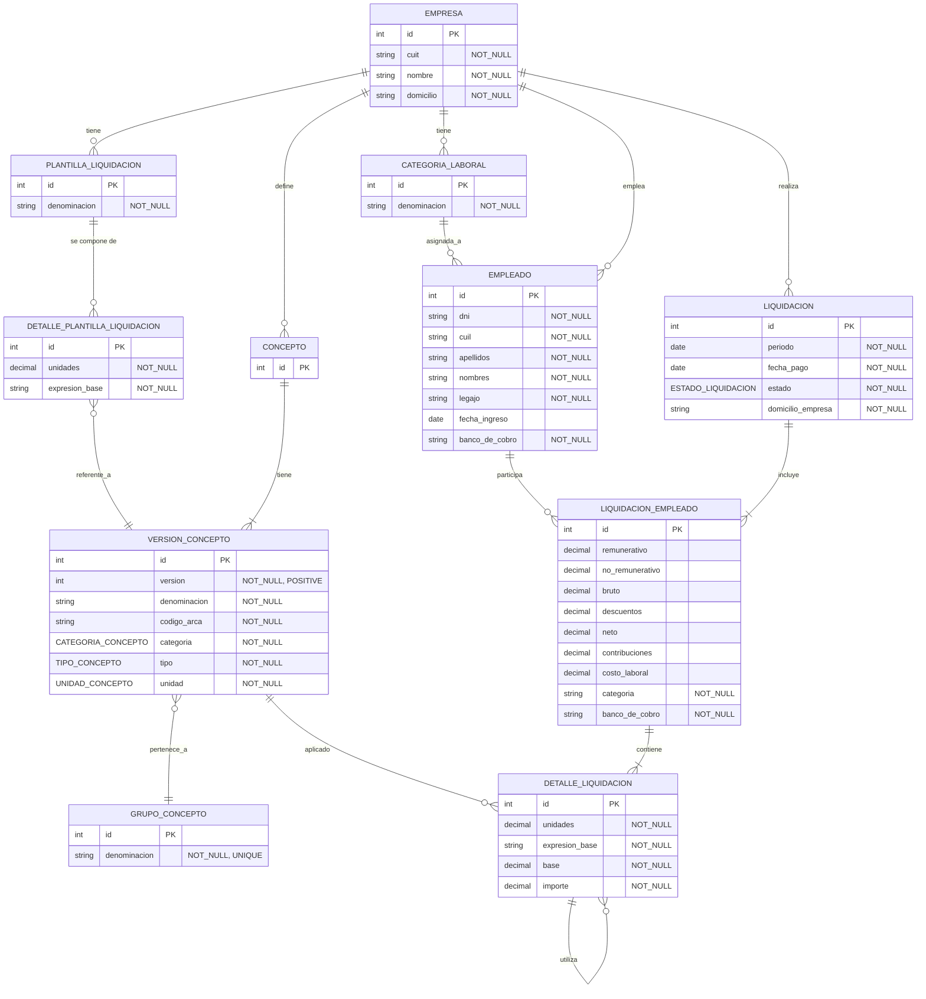

# Usuarios

Este sistema esta pensado y orientado a contadores que necesitan una solución inicial simple y económica para liquidar sueldos.

# Alcance

Este sistema permite:
- Ser utilizado de forma local en una única PC, almacenando los datos en el disco local.
- Mantener un conjunto de empresas con sus datos básicos.
- Mantener un conjunto de empleados, cada uno vinculado a una única empresa.
- Liquidar sueldos.
- Generar archivos TXT compatibles con el sistema Libro de Sueldos Digital de ARCA.
- Generar recibos de sueldo para cada empleado.
- Exportar recibos de sueldo en formato PDF.
- Mantener un historial de las liquidaciones realizadas y la información necesaria para regenerar sus recibos de sueldo y archivos TXT compatibles con el sistema Libro de Sueldos Digital de ARCA.
- Mantener el historial de versiones de los conceptos de liquidación.

Queda fuera del alcance:
- Rectificar una liquidación ya cerrada.
- Uso compartido o acceso simultáneo desde múltiples equipos.
- Autenticación y autorización de usuarios.
- Mantener un historial de versiones de los datos de las empresas y los empleados.
- Interactuar automática con los sistemas de ARCA.
- Cumplir requisitos de auditoría y trazabilidad contable.

# Dominio y Semántica

La información gestionada por el sistema puede clasificarse en dos grandes grupos:

1. Datos propios de las liquidaciones: corresponden a los resultados y valores utilizados durante el proceso de liquidación. Estos datos adquieren carácter histórico una vez que la liquidación es cerrada, por lo que no requieren un mecanismo adicional de versionado para preservar los resultados obtenidos.

2. Datos maestros: corresponden a la información utilizada como base para realizar las liquidaciones, como los datos de las empresas, empleados, categorías laborales y conceptos de liquidación. A diferencia de los datos propios de una liquidación, estos pueden modificarse a lo largo del tiempo, por lo que es necesario considerar mecanismos que permitan preservar la información relevante utilizada en liquidaciones anteriores.

# Casos de Uso

# Diagrama Entidad-Relación

